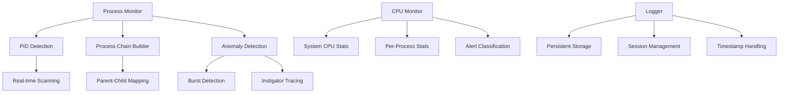

<h1 align="center">NetSnoop</h1>
<p align="center"><em>Born to Track.</em></p>


<div align="center">
    
[](https://python.org)
[](https://linux.org)


**🔍 A lightweight, real-time system activity monitor that tracks process creation on Linux systems through `/proc` filesystem analysis.**

</div>


## 🚀 Overview

NetSnoop is a low-level Python tool designed to monitor Linux systems in real-time by continuously scanning the `/proc` filesystem to detect and log new process creation. Built for security professionals, system administrators, and reverse engineers who need lightweight, efficient system monitoring without the overhead of complex tools.

---

## 🚀 Features

### 🔧 **Process Monitoring**
- **Real-time process detection** - Monitors new process spawns continuously
- **Complete process genealogy** - Traces full parent-child relationships
- **Multi-user support** - Tracks processes across all system users
- **Detailed process information** - Captures executable paths, command lines, and user contexts

### 🚨 **Anomaly Detection**
- **Process burst detection** - Identifies suspicious rapid process spawning
- **Intelligent instigator tracing** - Automatically identifies the root cause process
- **Smart filtering** - Ignores safe system processes to reduce false positives
- **Grouped alerts** - Batches related anomalies to prevent spam

### 💻 **CPU Monitoring**
- **System-wide CPU tracking** - Monitors overall system CPU usage
- **Per-process CPU analysis** - Tracks individual process CPU consumption
- **Multi-level alerting** - Critical, suspicious, and high usage alerts
- **Load average integration** - Correlates CPU usage with system load

### 📊 **Logging & Persistence**
- **Persistent logging** - All events saved to `netsnoop_persistent.txt`
- **Timestamped records** - IST timezone support for accurate timestamps
- **Session tracking** - Clear session boundaries with start/end markers
- **Graceful shutdown** - Proper cleanup and final log entries on exit

---

## 📈 Configuration

### Alert Thresholds
```python
# Process burst detection
burst_threshold = 8      # Number of processes to trigger alert
burst_window = 3         # Time window in seconds

# CPU monitoring
CPU_SAMPLE_WINDOW = 10   # Number of samples to keep
CPU_GROUP_WINDOW = 3     # Alert grouping window
CPU_GROUP_COOLDOWN = 10  # Cooldown between similar alerts
```

### CPU Alert Levels
- **🧨 CRITICAL**: >95% CPU usage for 5+ seconds
- **🚩 SUSPICIOUS**: >90% CPU usage (immediate alert)
- **🔺 HIGH**: >80% CPU usage for 3+ consecutive samples

---

## 📋 Output Examples

### Process Detection
```
[14:32:15] 🔧 New Process Detected:
    └── systemd (PID 1, User: root)
        └── SessionRelay (PID 1234, User: user)
            └── bash (PID 5678, User: user)
                └── python3 (PID 9101, User: user)
                    ├── Executable: /usr/bin/python3
                    └── CmdLine: python3 my_script.py
```

### Anomaly Alerts
```
⚠️  Multiple Anomalies Detected (Grouped):
  • [14:32:20] PID 5678 → 12 spawns — python3 build_script.py (PID 9101)
  • [14:32:22] PID 5678 → 8 spawns — gcc -O2 main.c (PID 9205)
```

### CPU Alerts
```
🧨 CRITICAL CPU: PID 9101 (python3) 98.5% for 5+s → python3 intensive_task.py
🚩 SUSPICIOUS CPU SPIKE: PID 9205 (gcc) 94.2% → gcc -O2 large_project.c
🔺 HIGH CPU ALERT: PID 9301 (make) 87.3% for 3s → make -j8 all
```

---

## 🏗️ Architecture

### System Workflow

```
┌─────────────────┐
│   🚀 START      │
│   NetSnoop      │
└─────────┬───────┘
          │
          ▼
┌─────────────────┐
│ Initialize      │
│ • Setup logging │
│ • Signal handlers│
│ • Session start │
└─────────┬───────┘
          │
          ▼
┌─────────────────┐
│ MAIN LOOP       │
│ Scan /proc/     │
│ for new PIDs    │
└─────────┬───────┘
          │
          ▼
┌─────────────────┐      NO     ┌─────────────────┐
│ New PIDs        │─────────────▶│ Check CPU       │
│ detected?       │              │ Anomalies       │
└─────────┬───────┘              └─────────┬───────┘
          │ YES                            │
          ▼                                │
┌─────────────────┐                       │
│ Build Process   │                       │
│ Chain Tree      │                       │
│ • Parent-child  │                       │
│ • User info     │                       │
│ • Command line  │                       │
└─────────┬───────┘                       │
          │                                │
          ▼                                │
┌─────────────────┐                       │
│ Log Process     │                       │
│ Details to      │                       │
│ Persistent File │                       │
└─────────┬───────┘                       │
          │                                │
          ▼                                │
┌─────────────────┐      NO                │
│ Process Burst   │──────────┐             │
│ Detected?       │          │             │
│ (>8 in 3 sec)   │          │             │
└─────────┬───────┘          │             │
          │ YES              │             │
          ▼                  │             │
┌─────────────────┐          │             │
│ Find Common     │          │             │
│ Parent PID      │          │             │
│ (Most frequent) │          │             │
└─────────┬───────┘          │             │
          │                  │             │
          ▼                  │             │
┌─────────────────┐   YES    │             │
│ Safe System     │──────────┤             │
│ Process?        │          │             │
│ (systemd, etc.) │          │             │
└─────────┬───────┘          │             │
          │ NO               │             │
          ▼                  │             │
┌─────────────────┐          │             │
│ Trace Real      │          │             │
│ Instigator      │          │             │
│ • Walk up tree  │          │             │
│ • Find scripts  │          │             │
│ • Identify user │          │             │
│   programs      │          │             │
└─────────┬───────┘          │             │
          │                  │             │
          ▼                  │             │
┌─────────────────┐          │             │
│ Buffer Anomaly  │          │             │
│ Alert (Group    │          │             │
│ for 5 seconds)  │          │             │
└─────────┬───────┘          │             │
          │                  │             │
          └──────────────────┘             │
                             │             │
                             ▼             │
                   ┌─────────────────┐     │
                   │ Check CPU       │◀────┘
                   │ Anomalies       │
                   │ • System CPU    │
                   │ • Process CPU   │
                   │ • Load average  │
                   └─────────┬───────┘
                             │
                             ▼
                   ┌─────────────────┐
                   │ CPU Threshold   │
                   │ Analysis        │
                   │ >95% = Critical │
                   │ >90% = Suspicious│
                   │ >80% = High     │
                   └─────────┬───────┘
                             │
                             ▼
                   ┌─────────────────┐
                   │ Group Similar   │
                   │ CPU Alerts      │
                   │ (3 sec window)  │
                   └─────────┬───────┘
                             │
                             ▼
                   ┌─────────────────┐
                   │ Display Alerts  │
                   │ • Process bursts│
                   │ • CPU warnings  │
                   │ • Log to file   │
                   └─────────┬───────┘
                             │
                             ▼
                   ┌─────────────────┐
                   │ Cleanup & Sleep │
                   │ • Remove old    │
                   │   process data  │
                   │ • Wait 1 second │
                   └─────────┬───────┘
                             │
                             └─────────┐
                                       │
          ┌────────────────────────────┘
          │
          ▼
┌─────────────────┐
│ Back to         │
│ MAIN LOOP       │
└─────────────────┘

    Signal (Ctrl+C)
          │
          ▼
┌─────────────────┐
│ Graceful        │
│ Shutdown        │
│ • Flush alerts  │
│ • Log session   │
│   end           │
│ • Exit cleanly  │
└─────────────────┘
```

### Core Components



### Key Algorithms

**Instigator Tracing**
1. Traverse process tree upward
2. Identify meaningful user programs
3. Filter out system processes
4. Find script executors and compilers
5. Return most likely root cause

**CPU Anomaly Detection**
1. Sample CPU usage every second
2. Track consecutive high usage periods
3. Group similar alerts to prevent spam
4. Correlate with system load average

---

## 🔧 Advanced Configuration

### Safe Process Filtering
```python
SAFE_PARENT_NAMES = {
    "systemd", "init", "rsyslogd", "cron", "agetty", 
    "dbus-daemon", "systemd-journal", "bash", "login"
}
```

### Custom Alert Colors
```python
CYAN = "\033[96m"      # Info messages
YELLOW = "\033[93m"    # Warnings
RED = "\033[91m"       # Critical alerts
GREEN = "\033[92m"     # Success messages
MAGENTA = "\033[95m"   # High CPU alerts
BLINK = "\033[5m"      # Critical emphasis
BOLD = "\033[1m"       # Alert emphasis
```

---

## 🚨 Use Cases

### Security Monitoring
- **Malware detection** - Identify suspicious process spawning patterns
- **Intrusion detection** - Monitor for unusual system activity
- **Privilege escalation** - Track process execution across users

### Development & Debugging
- **Build system monitoring** - Track compiler and build tool activity
- **Performance analysis** - Identify CPU-intensive processes
- **Resource leak detection** - Monitor for runaway processes

### System Administration
- **Capacity planning** - Understand system usage patterns
- **Troubleshooting** - Identify processes causing system issues
- **Audit logging** - Maintain detailed process execution records

---


### 🌟 NetSnoop - Making Linux Process Monitoring Simple and Effective 🌟


</div>
