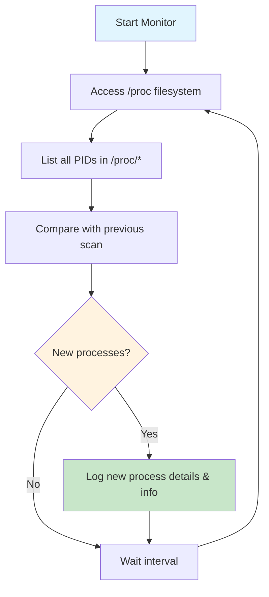

**🔍 A lightweight, real-time system activity monitor that tracks process creation on Linux systems through `/proc` filesystem analysis.**

## 🚀 Overview

NetSnoop is a low-level Python tool designed to monitor Linux systems in real-time by continuously scanning the `/proc` filesystem to detect and log new process creation. Built for security professionals, system administrators, and reverse engineers who need lightweight, efficient system monitoring without the overhead of complex tools.

## 🎯 Problem Statement

Modern Linux systems spawn hundreds of processes, making it challenging to:
- **Track malicious activity** - Detect suspicious process creation in real-time
- **Monitor system behavior** - Understand what applications are doing behind the scenes  
- **Debug applications** - Identify child processes and their execution patterns
- **Ensure security** - Catch unauthorized process execution attempts

Traditional monitoring tools are often heavyweight, require root privileges, or provide too much noise. NetSnoop fills this gap with a focused, efficient approach.

## 🏗️ Tool Architecture

### Core Components
- **Process Scanner**: Continuously monitors `/proc` for new PIDs
- **Delta Detector**: Identifies newly created processes by comparing PID lists
- **Logger**: Records process information with timestamps and metadata
- **Real-time Engine**: Maintains monitoring loop with configurable intervals

### System Flow

**Detailed Process Steps:**
1. **Start Monitor** - Initialize the monitoring system
2. **Access /proc** - Read the Linux process filesystem  
3. **List PIDs** - Enumerate all current process IDs
4. **Check for New** - Compare against previous scan results
5. **Log Activity** - Record new process information
6. **Repeat** - Continue monitoring with configurable intervals

## 📋 Features

- **Real-time Monitoring**: Continuous process detection with sub-second accuracy
- **Lightweight Design**: Minimal system resource usage
- **Detailed Logging**: Captures PID, command line, parent process, and execution time
- **No Root Required**: Operates with standard user privileges
- **Cross-distribution**: Works on any Linux distribution

## 🎯 Use Cases

### 🔒 System Security
- **Malware Detection**: Identify suspicious process creation patterns
- **Intrusion Monitoring**: Track unauthorized system access attempts
- **Compliance Auditing**: Log all process activity for security reviews

### 🔧 Reverse Engineering
- **Dynamic Analysis**: Monitor application behavior during runtime
- **Process Tracing**: Understand complex software execution flows
- **Debugging**: Identify child processes and their relationships

### 🏫 Educational & Research
- **System Learning**: Understand Linux process management
- **Security Research**: Analyze process-based attack vectors
- **Academic Projects**: Study system behavior patterns

  

## 📈 Performance Metrics

- **CPU Usage**: < 1% on modern systems
- **Memory Footprint**: ~10-20 MB RAM
- **Detection Latency**: < 100ms for new processes
- **Scalability**: Handles 1000+ processes efficiently

## 🛡️ Security Considerations

- **Non-intrusive**: Read-only access to `/proc` filesystem
- **No Privilege Escalation**: Runs with standard user permissions
- **Data Privacy**: Only logs process metadata, not content
- **Audit Trail**: All monitoring activity is logged

## 🔮 Future Scope

### Planned Features
- **Network Activity Correlation**: Link process creation to network connections
- **Container Awareness**: Docker/Podman process tracking
- **Machine Learning**: Anomaly detection for unusual process patterns
- **Web Dashboard**: Real-time web-based monitoring interface
- **Alert System**: Email/Slack notifications for specific events

### Potential Enhancements
- **Cross-platform Support**: Windows and macOS compatibility
- **Integration APIs**: Webhook support for SIEM tools
- **Advanced Filtering**: Regex-based process filtering
- **Historical Analysis**: Process creation trend analysis
- **Resource Correlation**: Link process activity to system resource usage

### 🌟 NetSnoop - Making Linux Process Monitoring Simple and Effective 🌟

